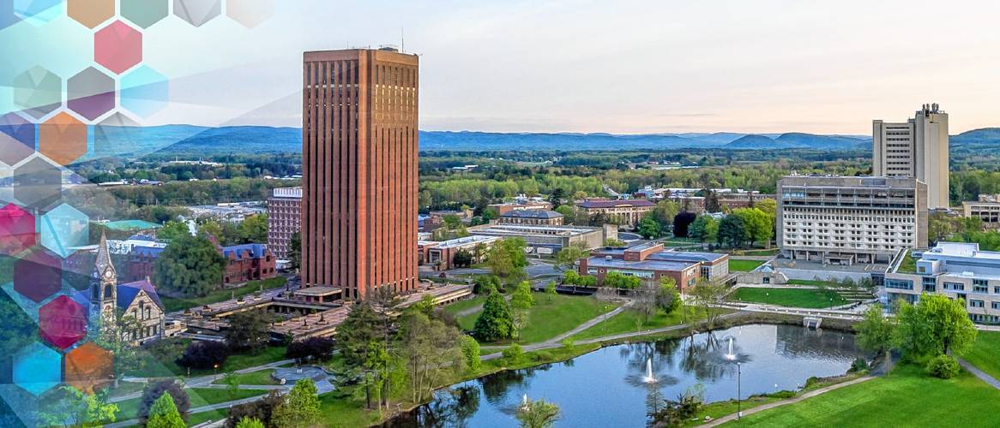

More about me!

My name is Lorene and I am a senior pursuing a dual degree in Chemistry and Math at UMass! I am currently working in Min Chen's research group in the Chemistry and BMB Department. I am also working in the Jeff Blanchard's research group in the Biology Department. I am really interested in the mathematical side of the life sciences and super excited to graduate in the spring!

Photo from: [https://www.google.com/url?sa=i&url=https%3A%2F%2Fwww.amherstbulletin.com%2FEditorial-University-of-Massachusetts-Amherst-has-work-to-do-before-achieving-goal-of-improving-campus-climate-of-inclusion-9646007&psig=AOvVaw1zWOK6FobWtHUlgVqj1JSm&ust=1605810983560000&source=images&cd=vfe&ved=0CA0QjhxqFwoTCPih4aLejO0CFQAAAAAdAAAAABAD](https://www.google.com/url?sa=i&url=https%3A%2F%2Fwww.amherstbulletin.com%2FEditorial-University-of-Massachusetts-Amherst-has-work-to-do-before-achieving-goal-of-improving-campus-climate-of-inclusion-9646007&psig=AOvVaw1zWOK6FobWtHUlgVqj1JSm&ust=1605810983560000&source=images&cd=vfe&ved=0CA0QjhxqFwoTCPih4aLejO0CFQAAAAAdAAAAABAD)